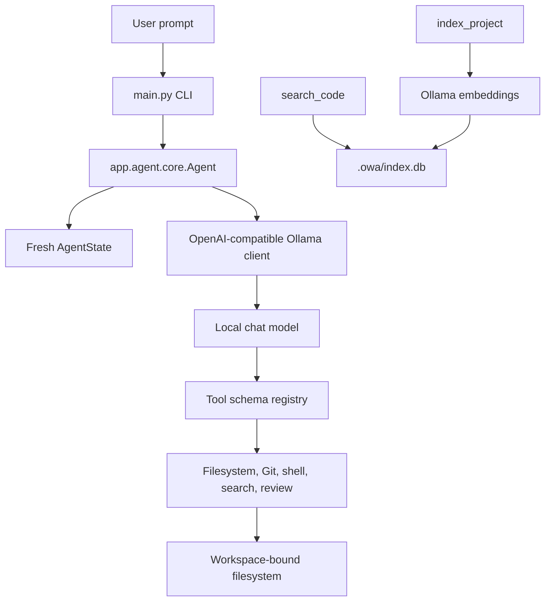

# Architecture

OwA is intentionally compact: one CLI, one local agent loop, a small set of workspace tools, and a local index for code search.

## Runtime flow

## Main modules

| Area | Module | Responsibility |
| --- | --- | --- |
| Entry point | `main.py` | CLI loop and top-level runtime setup |
| Agent | `app/agent/core.py` | system prompt, tool use loop, and task execution |
| State | `app/agent/state.py` | isolated state for each request |
| Verification | `app/agent/verifier.py` | task verification and follow-up behavior |
| LLM | `app/llm/client.py` | OpenAI-compatible calls to Ollama |
| Tools | `app/tools/` | workspace-aware tools exposed to the model |
| Indexer | `app/indexer/` | file selection, chunking, embedding, and ranking |
| API | `app/api.py` | FastAPI interface for local service usage |
| Config | `app/config.py` | env and config discovery |

## Agent loop

The workflow is straightforward:

1. the user sends a request
2. the agent builds a workspace-aware prompt and tool schema
3. the model decides whether to read files, search code, or edit files
4. the agent executes the selected tool with validation
5. the tool output is sent back to the model for the next step
6. the loop stops when the task is complete or a guardrail triggers

This keeps the behavior inspectable and makes it easier to reason about the decisions the agent makes.

## Tool registration

`app/tools/registry.py` keeps two linked structures:

- `TOOLS`: JSON schemas exposed to the model
- `FUNCTIONS`: Python callables that map to those names

This matters because the model only succeeds when the schema and callable names line up exactly. If one side is missing or mismatched, the tool call fails at runtime.

## Local indexing flow

`index_project` walks the workspace, filters supported extensions, splits files into chunks, and sends those chunks to the embedding model. The results are saved in a local SQLite database so later code searches can rank relevant files quickly.

The current design is intentionally simple and transparent:

- local on-disk storage
- plain Python orchestration
- no proprietary vector service required
- easy to inspect and modify for research or improvement

## Limits and trade-offs

This architecture is optimized for clarity and local development, not for huge enterprise-scale codebases. The current implementation is synchronous and easy to audit, but it does not yet implement advanced vector indexing or sophisticated repository-wide ranking.
