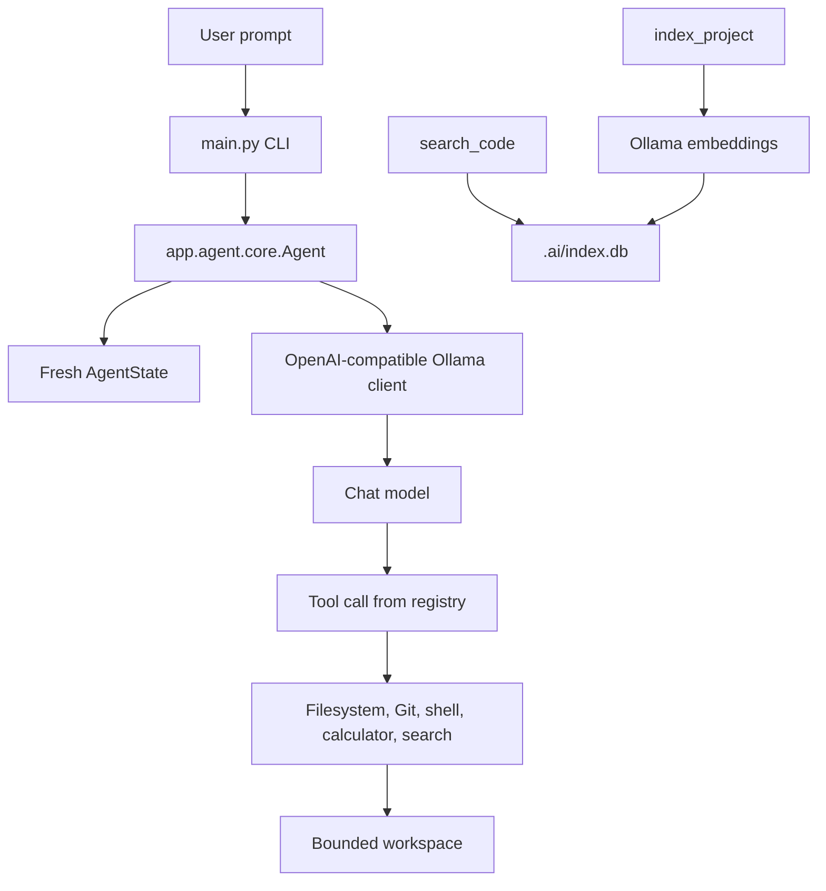

# Architecture

## Runtime flow

## Main modules

| Area | Module | Responsibility |
| --- | --- | --- |
| Entry point | `main.py` | Interactive CLI loop and top-level exception display. |
| Agent | `app/agent/core.py` | System prompt, tool-call loop, workspace context, and task execution. |
| State | `app/agent/state.py` | Per-request task state. |
| Verification | `app/agent/verifier.py` | Verification-related agent behavior. |
| LLM | `app/llm/client.py` | HTTP client for OpenAI-compatible chat completions. |
| Tools | `app/tools/` | Explicit functions exposed to the model. |
| Indexer | `app/indexer/` | File selection, chunking, embeddings, SQLite persistence, and ranking. |
| Domain example | `app/calculator.py` | Small arithmetic tool surface covered by tests. |

## Agent loop

The agent receives the user request and a system prompt containing the workspace root and operating rules. The model is given the registered tool schemas. When it emits a tool call, the agent resolves the function from `FUNCTIONS`, parses the arguments, executes the function, and returns the result to the model for the next step.

The loop is bounded by a maximum number of iterations and tool calls. This limits runaway behavior but is not a complete resource or security policy.

## Tool registration

`app/tools/registry.py` contains two related structures:

- `TOOLS`: JSON-compatible function schemas sent to the model.
- `FUNCTIONS`: names mapped to Python callables.

A new tool must be present in both structures. A schema mismatch or missing function mapping will fail at runtime when the model selects that tool.

## Data flow for code search

1. `index_project` walks the workspace and filters supported text extensions.
2. `chunk_text` splits files into overlapping text chunks.
3. `embed` sends each chunk to Ollama.
4. `save_chunk` stores path, chunk number, content, and serialized embedding in SQLite.
5. `search_code` embeds the query, scores stored chunks, sorts them, and formats the top results.

The current implementation is deliberately synchronous and stores vectors as JSON blobs. This is easy to inspect, but it is not optimized for large repositories.
