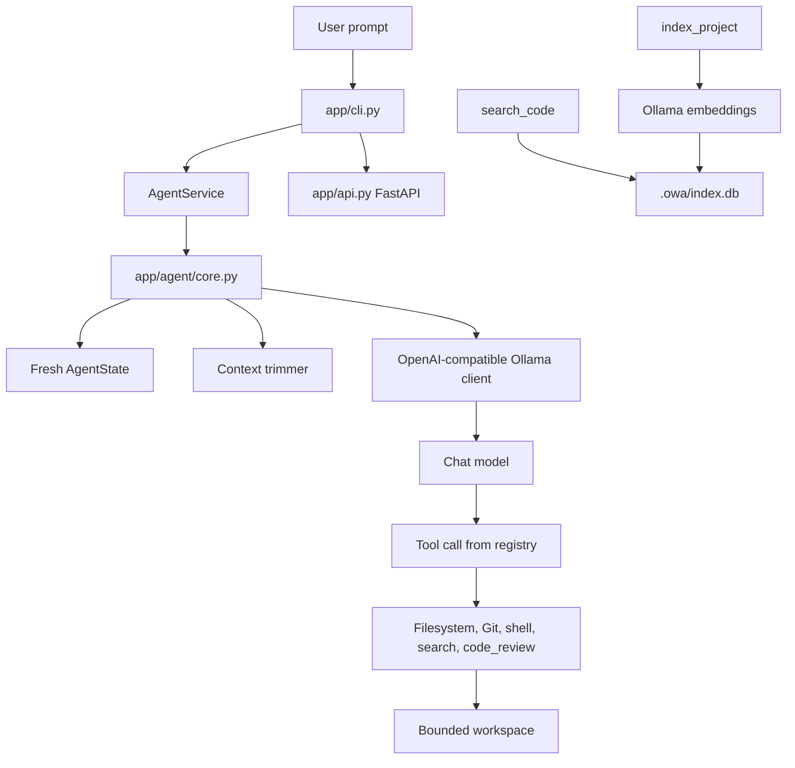

# Architecture

## Runtime flow

## Main modules

| Area | Module | Responsibility |
| --- | --- | --- |
| Entry point | `main.py` | Thin shim — delegates to `app/cli.py`. |
| CLI | `app/cli.py` | Banner, prompt loop, commands, spinner, Markdown rendering. |
| Config | `app/config.py` | Global config path at `~/.config/owa/.env`. |
| Service | `app/service.py` | Shared chat, indexing, status, and clear — used by CLI and API. |
| API | `app/api.py` | FastAPI endpoints: `/health`, `/status`, `/chat`, `/chat/stream`, `/clear`, `/index`. |
| Agent | `app/agent/core.py` | System prompt, tool-call loop, context trimming, session memory, workspace context. |
| State | `app/agent/state.py` | Per-request task state — files changed, tool calls, errors. |
| Verifier | `app/agent/verifier.py` | Post-tool result verification. |
| LLM | `app/llm/client.py` | HTTP client for OpenAI-compatible chat completions. Model read from env on each call. |
| Tools | `app/tools/` | Explicit functions exposed to the model. |
| Indexer | `app/indexer/` | File selection, chunking, embeddings, SQLite persistence, and ranking. |

## Agent loop

The agent receives the user request and a system prompt containing the workspace root, OwA version, and operating rules. The model is given the registered tool schemas. When it emits a tool call, the agent resolves the function from `FUNCTIONS`, parses the arguments, executes the function, and returns the result to the model for the next step.

The loop is bounded by a maximum of 20 iterations and 50 tool calls. Before each LLM call, the message history is trimmed to the last 20 user/assistant pairs — the system prompt is always preserved.

## Tool registration

`app/tools/registry.py` contains two related structures:

- `TOOLS`: JSON-compatible function schemas sent to the model.
- `FUNCTIONS`: names mapped to Python callables.

A new tool must be present in both structures. A schema mismatch or missing function mapping will fail at runtime when the model selects that tool.

## Session memory

Conversation history is saved to `.owa/history.json` after each response and loaded on startup. `/clear` deletes the file and resets the in-memory message list.

## Data flow for code search

1. `index_project` walks the workspace and filters supported text extensions, respecting `IGNORED_DIRS` and `.owaignore`.
2. `chunk_text` splits files into overlapping text chunks.
3. `embed` sends each chunk to Ollama's `/api/embed` endpoint.
4. `save_chunk` stores path, chunk number, content, and serialized embedding in `.owa/index.db`.
5. `search_code` embeds the query, scores stored chunks by cosine similarity, and returns the top results.

The implementation is deliberately synchronous and stores vectors as JSON blobs — easy to inspect, not optimized for large repositories.
